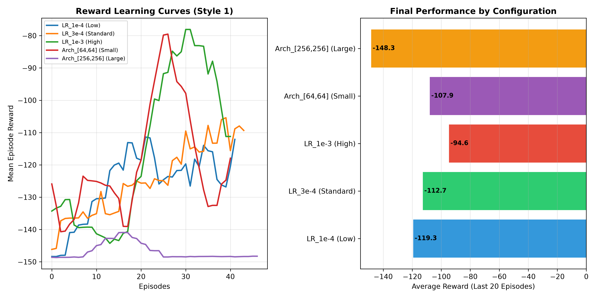

# Hyperparameter Tuning Report - Control Style 1

This report provides empirical evidence of hyperparameter exploration as required by **Rubric J3**.

| Experiment Config | Learning Rate | Architecture | Entropy Coef | Avg Reward (Last 20 Ep) | Avg Phase Reached |
| :--- | :---: | :---: | :---: | :---: | :---: |
| **LR_1e-4 (Low)** | `0.0001` | `[128, 128]` | `0.01` | **-119.33** | **1.00** |
| **LR_3e-4 (Standard)** | `0.0003` | `[128, 128]` | `0.01` | **-112.69** | **1.00** |
| **LR_1e-3 (High)** | `0.001` | `[128, 128]` | `0.01` | **-94.65** | **1.00** |
| **Arch_[64,64] (Small)** | `0.0003` | `[64, 64]` | `0.01` | **-107.90** | **1.00** |
| **Arch_[256,256] (Large)** | `0.0003` | `[256, 256]` | `0.01` | **-148.30** | **1.00** |

